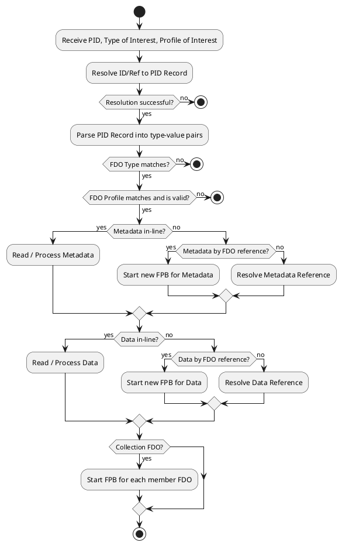
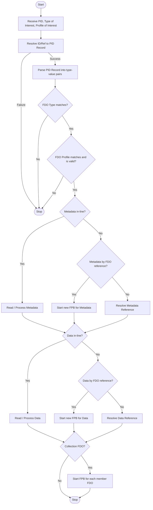
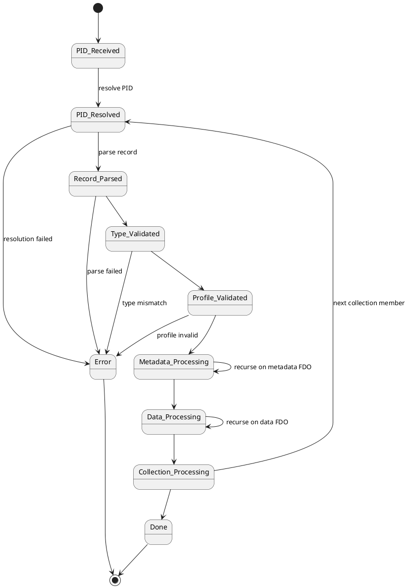
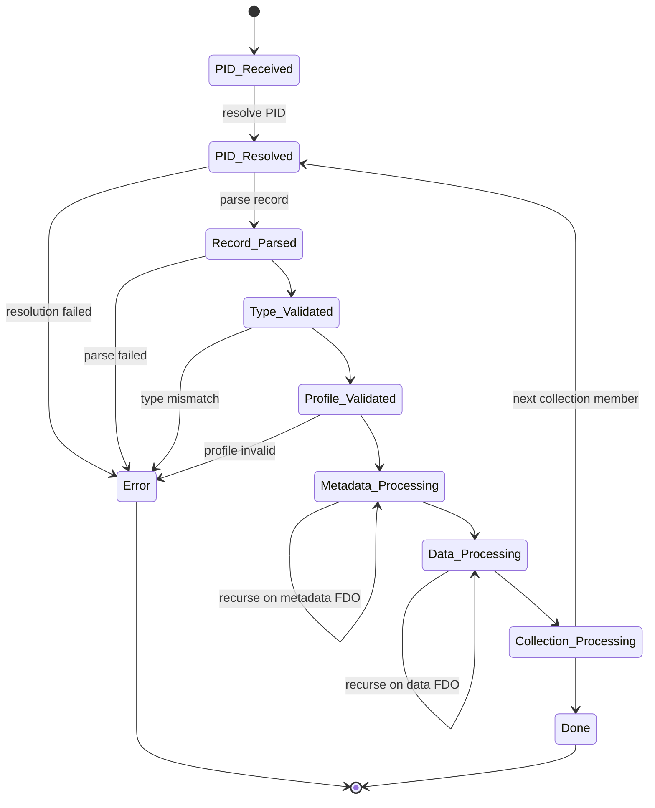

# Diagramming in the FDOF TSIG

Christian Backe, christian.backe@dfki.de

Created: 2026-02-02

Last Update: 2026-02-02

---

## Contents

&nbsp;1. Introduction 
&nbsp;2. Requirements for diagram tools 
&nbsp;3. Diagram types and standards 
&nbsp;&nbsp;&nbsp;&nbsp;&nbsp;3.1. UML 
&nbsp;&nbsp;&nbsp;&nbsp;&nbsp;3.2. Non-UML (Selection) 
&nbsp;4. Diagram tool options 
&nbsp;&nbsp;&nbsp;&nbsp;&nbsp;4.1. Non-Options 
&nbsp;&nbsp;&nbsp;&nbsp;&nbsp;4.2. PlantUML 
&nbsp;&nbsp;&nbsp;&nbsp;&nbsp;4.3. Mermaid 
&nbsp;&nbsp;&nbsp;&nbsp;&nbsp;4.4. yEd 
&nbsp;&nbsp;&nbsp;&nbsp;&nbsp;4.5. Inkscape 
&nbsp;&nbsp;&nbsp;&nbsp;&nbsp;4.6. (diagrams.net (aka draw.io)) 
&nbsp;&nbsp;&nbsp;&nbsp;&nbsp;4.7. (Lucidchart) 
&nbsp;5. Diagram examples "FDO Processing Block" 
&nbsp;&nbsp;&nbsp;&nbsp;&nbsp;5.1. UML Activity Diagram 
&nbsp;&nbsp;&nbsp;&nbsp;&nbsp;&nbsp;&nbsp;&nbsp;&nbsp;5.1.1. PlantUML 
&nbsp;&nbsp;&nbsp;&nbsp;&nbsp;&nbsp;&nbsp;&nbsp;&nbsp;5.1.2. Mermaid 
&nbsp;&nbsp;&nbsp;&nbsp;&nbsp;&nbsp;&nbsp;&nbsp;&nbsp;5.1.3. yEd 
&nbsp;&nbsp;&nbsp;&nbsp;&nbsp;&nbsp;&nbsp;&nbsp;&nbsp;5.1.4. Inkscape 
&nbsp;&nbsp;&nbsp;&nbsp;&nbsp;5.2. UML State Diagram 
&nbsp;&nbsp;&nbsp;&nbsp;&nbsp;&nbsp;&nbsp;&nbsp;&nbsp;5.2.1. PlantUML 
&nbsp;&nbsp;&nbsp;&nbsp;&nbsp;&nbsp;&nbsp;&nbsp;&nbsp;5.2.2. Mermaid 
&nbsp;&nbsp;&nbsp;&nbsp;&nbsp;&nbsp;&nbsp;&nbsp;&nbsp;5.2.3. yEd 
&nbsp;&nbsp;&nbsp;&nbsp;&nbsp;&nbsp;&nbsp;&nbsp;&nbsp;5.2.4. Inkscape 
&nbsp;6. Suggested workflow 
&nbsp;&nbsp;&nbsp;&nbsp;&nbsp;6.1. Initial prototype creation 
&nbsp;&nbsp;&nbsp;&nbsp;&nbsp;6.2. Iterative, collaborative prototype update 
&nbsp;&nbsp;&nbsp;&nbsp;&nbsp;6.3. Transition to production-grade quality 

## 1. Introduction

This document discusses requirements and options for diagram tools to support the work of the Technical Specification and Implementation Group (TSIG) of the FAIR Digital Objects (FDO) Forum.

It was initiated by a discussion on 2026-01-27 in the TSIG subgroup for the "Processing Document".

Purpose / Scope:

- Not just "a new image draft to illustrate a specific document section". (Illustrations should be initiated by the person who wrote a text section, and should be improved collaboratively.)
- But: Prepare group discussion of tools and routines for collaborative and iterative work (on diagrams).

## 2. Requirements for diagram tools

- Functional requirements
    - Support all necessary diagram types (UML et al. --> TBD, see Section "Diagram types and standards")
    - Easy to use for active TSIG members
    - Support quick prototyping
    - Support publication-grade quality
    - Smooth transition from prototype to publication
    - Integrate well with text editing tools
    - Integrate well with collaborative and iterative work flows
- Administrative requirements
    - Version-controllable (=> text-based source files)
    - Local-first (no cloud-only tools)
    - Cross-platform (Linux, Windows, Mac)
    - Gratis

## 3. Diagram types and standards

### 3.1. UML

- [ISO/IEC 19501:2005(E) "Unified Modeling Language Specification" (PDF)](https://www.omg.org/spec/UML/ISO/19501/PDF)
    - [Source: Object Management Group (omg.org)](https://www.omg.org/about/)
- [uml-diagrams.org](https://www.uml-diagrams.org/)
- [UML diagram types (Wikipedia)](https://en.wikipedia.org/wiki/Unified_Modeling_Language#Diagrams)
    - Behavioral UML diagrams
        - **Activity diagram**
            - [Overview (uml-diagrams.org)](https://www.uml-diagrams.org/activity-diagrams.html)
            - [Examples (uml-diagrams.org)](https://www.uml-diagrams.org/activity-diagrams-examples.html)
        - Communication diagram
        - Interaction overview diagram
        - **Sequence diagram**
            - [Overview (uml-diagrams.org)](https://www.uml-diagrams.org/sequence-diagrams.html)
            - [Examples (uml-diagrams.org)](https://www.uml-diagrams.org/sequence-diagrams-examples.html)
        - **State machine diagram**
            - [Overview (uml-diagrams.org)](https://www.uml-diagrams.org/state-machine-diagrams.html)
            - [Examples (uml-diagrams.org)](https://www.uml-diagrams.org/state-machine-diagrams-examples.html)
        - Timing diagram
        - **Use case diagram**
            - [Overview (uml-diagrams.org)](https://www.uml-diagrams.org/use-case-diagrams.html)
            - [Examples (uml-diagrams.org)](https://www.uml-diagrams.org/use-case-diagrams-examples.html)
    - Structural UML diagrams
        - **Class diagram**
            - [Overview (uml-diagrams.org)](https://www.uml-diagrams.org/class-diagrams-overview.html)
            - [Examples (uml-diagrams.org)](https://www.uml-diagrams.org/class-diagrams-examples.html)
        - **Component diagram**
            - [Overview (uml-diagrams.org)](https://www.uml-diagrams.org/component-diagrams.html)
            - [Examples (uml-diagrams.org)](https://www.uml-diagrams.org/component-diagrams-examples.html)
        - Composite structure diagram
        - Deployment diagram
        - **Object diagram**
            - [Overview (uml-diagrams.org)](https://www.uml-diagrams.org/class-diagrams-overview.html#object-diagram)
            - [Examples (uml-diagrams.org)](https://www.uml-diagrams.org/online-shopping-user-login-uml-object-diagram-example.html)
        - Package diagram
        - Profile diagram

### 3.2. Non-UML (Selection)

- Flowchart (-> Similar to UML activity diagram)
- Dataflow diagram
- Network diagram
- Entity-Relationship-Diagram
- BPMN diagram
- C4 model
- RDF graph
- Sitemap
- Organizational chart
- Venn diagram
- Wireframe
- Gantt Chart
- Mindmap
- ...

## 4. Diagram tool options

### 4.1. Non-Options

- Microsoft Visio / Powerpoint / Paint / ...
    - (-) Not cross-platform
    - (-) Not version-controllable
    - (-) Not easy to use
    - (-) Not gratis
    - (-) No publication-grade quality
- LibreOffice Impress / Draw / ...
    - (-) Not version-controllable
    - (-) Not easy to use
    - (-) No publication-grade quality
- Adobe Illustrator / Photoshop / ...
    - (-) Not cross-platform
    - (-) Not version-controllable
    - (-) Not easy to use
    - (-) Not gratis
- Miro Board
    - (-) Not local
    - (-) Not version-controllable
    - (-) Limited diagram types (for gratis version)
    - (-) No publication-grade quality
- Graphviz
    - (-) Difficult to use for anything but the simplest diagram types
        - Note: Some syntax-to-diagram tools use Graphviz internally as an intermediate format, thus shielding the complexity from the user.
    - (-) No publication-grade quality
- Data visualization library (e.g., Matplotlib)
    - (-) Weird, roundabout approach
    - (-) Not easy to use
- ... ???

### 4.2. PlantUML

- Syntax-to-Image
    - (+) Quick prototyping
    - (+) Version-controllable
    - (+/-) (Easy to use ?)
    - (+/-) (GitHub / GitLab integration requires extra steps ?)
    - (-) Limited output control (=> hardly publication-grade quality)
    - (-) Transition from prototype to publication seems to require additional tooling and effort
- Broad support of UML and non-UML diagrams
    - UML:
        - Sequence diagram
        - State diagram
        - Activity diagram
        - Usecase diagram
        - Class diagram
        - Object diagram
        - Component diagram
        - Deployment diagram
        - Timing diagram
    - non-UML:
        - JSON Data
        - YAML Data
        - Network diagram (nwdiag)
        - Wireframe graphical interface
        - Specification and Description Language (SDL)
        - Gantt diagram
        - MindMap diagram
        - Entity Relationship diagram
        - Archimate diagram
        - Ditaa diagram
        - Work Breakdown Structure diagram
        - Mathematic with AsciiMath or JLaTeXMath notation
- PlantUML Resources:
    - [Wikipedia: PlantUML](https://en.wikipedia.org/wiki/PlantUML)
    - [PlantUML Homepage](https://plantuml.com/)
        - [PlantUML Language Reference Guide (PDF)](https://plantuml.com/guide)
        - [PlantUML Quick Start Guide](https://plantuml.com/starting)
    - PlantUML Online Editors and "Hello World" examples:
        - [plantuml.com](https://www.plantuml.com/plantuml/uml/SyfFKj2rKt3CoKnELR1Io4ZDoSa700003)
        - [plantuml.online](https://plantuml.online/uml/TLBDRjGm4BxxAJws4cqbYk30fGSGLA2kHCMAqbP8Ut6IIMAjCuuyZjA0a7W8df0dOPpTxUw5IsBDzpFVZ2qRnxsDjeCjKuYtQV84EvA4ZemyWHNLTl3f6psczzurt14dbFgXUCJgxECDYTY6RjqFmkithupXK14MzowxdmgkrNVDNwtq1SKuOUKM-6c0CdHzuEowM7dBwUxcCxwmTwpi1ohmAGPjnjK2Lg25_qW-SZDBhfHjzHGrnrQpHSmlO-P1zv7MVFOz357zdRhxQSrFNjT1qlcitL9nefEtgOb4l3Uv4zfPFDjISm4dOdqNs9YTyEBYRSwCIwo6mZjfIJ3qbKqaPXOS25UHSXcLiuskL4mkPtYRFrlOA4fuZgY1AOevMEpQNUB3C0awlKXTKbqJvMj814zrGgXtFBCyrLk713ya5rXWOzcwH6Lw2PWbwX0tLC5oXLPNeSVKEe4eHN55qKq88sCGmj_VVsOcXr6bqjf8S0cZIoqctOwX6KpxA36lCcV9uSsoFlBMVqk-hmUF5BBuXRPhmmXRX26X62R7pV5qxyoPFfGD0giBgQZFnhq-m_D3sty0)
        - [planttext.com](https://www.planttext.com/)
    - PlantUML Integrations:
        - https://docs.gitlab.com/user/markdown/#diagrams-and-flowcharts
    - [PlantUML Source Code (GitHub)](https://github.com/plantuml/plantuml)

### 4.3. Mermaid

- Syntax-to-Image
    - (+) Quick prototyping
    - (+) Version-controllable
    - (+/-) (Easy to use ?)
    - (+) GitHub and GitLab integration "out of the box"
    - (-) Limited output control (=> hardly publication-grade quality)
    - (-) Transition from prototype to publication seems to require additional tooling and effort
- Available diagram types
    - ... (TODO)
    - Mermaid does not have a native UML Activity Diagram type. An idiomatic alternative is a flowchart.
- Mermaid Resources:
    - [Wikipedia: Mermaid (software)](https://en.wikipedia.org/wiki/Mermaid_(software))
    - [Mermaid Homepage](https://mermaid.js.org/)
        - [Mermaid Introduction](https://mermaid.js.org/intro/)
        - [Mermaid Tutorials](https://mermaid.js.org/ecosystem/tutorials.html)
        - [Mermaid Integrations](https://mermaid.js.org/ecosystem/integrations-community.html)
            - https://github.blog/developer-skills/github/include-diagrams-markdown-files-mermaid/
            - https://github.com/SimonKenyonShepard/mermaidjs-github-svg-generator
            - https://docs.gitlab.com/user/markdown/#diagrams-and-flowcharts
    - Mermaid Online Editors and "Hello World" examples:
        - [mermaid.live](https://mermaid.live/edit#pako:eNpVjcFugzAQRH_F2lMrQQTBIeBDpYa0uURqDzkVcrDCglGDjYxRmgL_XkMUtd297GjezPZwUjkCg-KsLifBtSGHbSaJnec0EbpqTc3bI3Hdp2GHhtRK4nUgm4edIq1QTVPJ8vHGbyaIJP1-wpAYUcnP8WYlc_5N4kC26Z43RjXHv87hogbyklbvwtb_d4RGm3pNC84K7p64JgnXMwIOlLrKgRndoQM16ppPEvrJzcAIrDEDZs8cC96dTQaZHG2s4fJDqfqe1KorBdj6c2tV1-Tc4Lbipea_CMocdaI6aYD5wVwBrIcvYDRcBP5y5fuUUi_2IweuwOJoEYV0Ga_s0vUyDEcHvueX3iJa03gaL1qHgReOP9t1dnM)
        - [mermaid.ai/play](https://mermaid.ai/play?utm_source=mermaid_live_editor&utm_medium=share#pako:eNp1kl9zojAUxb9KJk_bGbULKro87M4qtbX1D9W-bIWHFC7KDCROCG1d9LtvQgpYp-uD403u-d1zci1wwELANo4S9hbsCBfoyfEokp_f3zZrIQ_8K9Ru_0SjzQoCiF8BuVOnhZ4Oe0AsQlMqgEMmWsjlLIqTT4e-RzVrVCLGEpGxRCKmzvUKIiSYgiEJZjz0detYtR7XeRBAlh2Rs3EJz-CsD8VU6oSc334lSQ5oT2KefVJPSJzkHI7oWWVge_-qMuKURm6KibPUEVIigh1kv076_qbUL5iUnh_8AWllUqqqmB9CRKh0lCFpJQ4VRcsml5xJw7kt5iBISASRUdpJTKHR3TZtd_K1SIiu1UT1FqhS-eetasS0Ab4ckDLJIZILoMEZedqQ7_ViEYU3NHFHKGL8Ej6t4Q_10uohq4pe7_eufNZZ4VyEUnf3-k4XD1Why1ljan4Z12nczGo3Cz3i_zEXDXH5Rcwz6KKGunVE5-t489L1YzFmSQKBiBlV46uAS32rC7cqdPnY2Fl92KmsAAl2KIX0Bbii-ecC5Wp9-d9dlei1R3ELb3kcYlvwHFo4BZ4SVeJCNXpY7CAFD9vyZwgRyRPhYY-epGxP6DNjaaXkLN_usB2RJJNVvpfbBScmW06aFqAh8DHLqcC2aQ1KBrYL_C5Ls9vpWYOu0ZdfQ3NomC18UF0dY9jvDnuD_veuZZnGqYX_llONzrBnGEOzZ_Ysy_jRtXqnf83FYiU)

### 4.4. yEd

- Diagramming tool; GUI desktop app; Java-based; gratis; GRAPHML source + various export formats (SVG, PNG, ...)
    - (+) Cross-platform
    - (+) Version-controllable
    - (+) Quick prototyping
    - (+) Publication-grade quality
    - (+) Smooth transition from prototype to publication
    - (+) Gratis
    - (+) Support for necessary diagram types (some quirks, but manageable)
    - (+) Fairly easy to use (some getting-used-to; in-group workshop and support possible)
- yEd Resources:
    - [Wikipedia: yEd](https://en.wikipedia.org/wiki/YEd)
    - [yEd Homepage](https://www.yworks.com/products/yed)
        - [yEd Download](https://www.yworks.com/downloads#yEd)
    - [yEd Online Editor (yworks.com)](https://www.yworks.com/yed-live/)

### 4.5. Inkscape

- SVG editor; GUI desktop app; Cross-platform; gratis
    - (+) Cross-platform
    - (+) Version-controllable
    - (+) Support for any diagram imaginable
    - (+) Publication-grade quality
    - (+) Gratis
    - (-) Not easy to use (no in-group support?)
    - (-) No quick prototyping
- Inkscape Resources:
    - [Wikipedia: Inkscape](https://en.wikipedia.org/wiki/Inkscape)
    - [Wikipedia: How to draw a diagram with Inkscape](https://en.wikipedia.org/wiki/Wikipedia:How_to_draw_a_diagram_with_Inkscape)
    - [Inkscape Homepage](https://inkscape.org/)
        - [Inkscape Wiki](https://wiki.inkscape.org/wiki/Inkscape)

### 4.6. (diagrams.net (aka draw.io))

- https://en.wikipedia.org/wiki/Diagrams.net
- https://app.diagrams.net/

### 4.7. (Lucidchart)

- https://en.wikipedia.org/wiki/Lucidchart

## 5. Diagram examples "FDO Processing Block"

### 5.1. UML Activity Diagram

#### 5.1.1. PlantUML

https://www.plantuml.com/plantuml/uml/dPBHQiCW68NlVOfpsK9BxvkBbKqAlHWBsLx0cbyg62rgElBsqmnBievrsrqY__dEEVxkGXG-zfrXumVRDYH9NmZrWQ_mDfm9Jk5W8taASONQEwNDxB1YMHMSIQe3tpIa45tM8x6SRokc5HRZH1-rimYzb1I2wit34l545ek1mf81srhuG1Cjj4sic6AiByBqXBFGFbICJ20ihCkY4DsPaMsrOgFJdhzy1kz4b2SACvDxobAmY25i2X6Gt7NxUz8pHT6AA5B-jT6MRees95fiibk-2fJvURCPwJWWv_Eao9ELDyW4VSqhXALtxEj7AESdN61A1guhkneqXPo7noxJHlmFRVYtJVY_M_2V6_3xwP-SCIJ7rvVilvWMos97GfxGKNSadwUh0XgNl4i_VMS-0000

https://www.plantuml.com/plantuml/svg/dPF1Qkim54Jt-efP9f2GVRnuuLK4iYWrRdz0iKT484j1abFozxLS76nIchQxnDmvSuyltiMaGkfQAuOVObknfhaGvK6ky7Oz4rxZu183OrgX35uREtjOY9oAtlQfWznKr4W-vz6pV6WAOJGMmqINZ7U8NLqpHjtPVqka4nqMLyQb0BQb2f6JB8phMQbVOtrHjYFEoeHO2Df8B9pFePZyMT0rHekXQIzVFXTlLQfFZFEI1ybHS0n3kGOcecytpSz9pqogKKd1kBKrZdUY5LM3JMxBhmBZ_DniHZfUaVSBr0nqzHsoXxxc4yBn7VloFxGF4oum9GEtazqAgf6SXmUNgP7yXOtyqaJ-sK9-Ro0VR__ahMMTZ7UvVbuwLjxggEeJMhP7XZnTZA3XoBl-J_vSFW00

#### 5.1.2. Mermaid

https://mermaid.live/edit#pako:eNp1kl9zojAUxb9KJk_bGbULKro87M4qtbX1D9W-bIWHFC7KDCROCG1d9LtvQgpYp-uD403u-d1zci1wwELANo4S9hbsCBfoyfEokp_f3zZrIQ_8K9Ru_0SjzQoCiF8BuVOnhZ4Oe0AsQlMqgEMmWsjlLIqTT4e-RzVrVCLGEpGxRCKmzvUKIiSYgiEJZjz0detYtR7XeRBAlh2Rs3EJz-CsD8VU6oSc334lSQ5oT2KefVJPSJzkHI7oWWVge_-qMuKURm6KibPUEVIigh1kv076_qbUL5iUnh_8AWllUqqqmB9CRKh0lCFpJQ4VRcsml5xJw7kt5iBISASRUdpJTKHR3TZtd_K1SIiu1UT1FqhS-eetasS0Ab4ckDLJIZILoMEZedqQ7_ViEYU3NHFHKGL8Ej6t4Q_10uohq4pe7_eufNZZ4VyEUnf3-k4XD1Why1ljan4Z12nczGo3Cz3i_zEXDXH5Rcwz6KKGunVE5-t489L1YzFmSQKBiBlV46uAS32rC7cqdPnY2Fl92KmsAAl2KIX0Bbii-ecC5Wp9-d9dlei1R3ELb3kcYlvwHFo4BZ4SVeJCNXpY7CAFD9vyZwgRyRPhYY-epGxP6DNjaaXkLN_usB2RJJNVvpfbBScmW06aFqAh8DHLqcC2aQ1KBrYL_C5Ls9vpWYOu0ZdfQ3NomC18UF0dY9jvDnuD_veuZZnGqYX_llONzrBnGEOzZ_Ysy_jRtXqnf83FYiU

https://mermaid.ai/play?utm_source=mermaid_live_editor&utm_medium=share#pako:eNp1kl9zojAUxb9KJk_bGbULKro87M4qtbX1D9W-bIWHFC7KDCROCG1d9LtvQgpYp-uD403u-d1zci1wwELANo4S9hbsCBfoyfEokp_f3zZrIQ_8K9Ru_0SjzQoCiF8BuVOnhZ4Oe0AsQlMqgEMmWsjlLIqTT4e-RzVrVCLGEpGxRCKmzvUKIiSYgiEJZjz0detYtR7XeRBAlh2Rs3EJz-CsD8VU6oSc334lSQ5oT2KefVJPSJzkHI7oWWVge_-qMuKURm6KibPUEVIigh1kv076_qbUL5iUnh_8AWllUqqqmB9CRKh0lCFpJQ4VRcsml5xJw7kt5iBISASRUdpJTKHR3TZtd_K1SIiu1UT1FqhS-eetasS0Ab4ckDLJIZILoMEZedqQ7_ViEYU3NHFHKGL8Ej6t4Q_10uohq4pe7_eufNZZ4VyEUnf3-k4XD1Why1ljan4Z12nczGo3Cz3i_zEXDXH5Rcwz6KKGunVE5-t489L1YzFmSQKBiBlV46uAS32rC7cqdPnY2Fl92KmsAAl2KIX0Bbii-ecC5Wp9-d9dlei1R3ELb3kcYlvwHFo4BZ4SVeJCNXpY7CAFD9vyZwgRyRPhYY-epGxP6DNjaaXkLN_usB2RJJNVvpfbBScmW06aFqAh8DHLqcC2aQ1KBrYL_C5Ls9vpWYOu0ZdfQ3NomC18UF0dY9jvDnuD_veuZZnGqYX_llONzrBnGEOzZ_Ysy_jRtXqnf83FYiU

[](https://mermaid.live/edit#pako:eNp1kklz4jAQhf-KSqdJFSQsZrEPMzXgkDhhC-QywRwUuw2usiVKlpMwhv8-khUvoTI-0VK_r99Tk2GP-YAtHETs3dsTLtCz7VIkv98_NmshD7ZXqNn8iUabFXgQvgFaOnYDPR8PgFiAHCqAQyIaaMlZEEZfDrcu1axRjhhLRMIiiXDsmxUESDAFQxLMuL_VrWPVelqnngdJckL2Zkl4ArU-FFKpE3J-841EKaADCXnyRT0hYZRyOKEXlYEdtleFETs3cptN7IWOEBPh7SH5ddb3t7l-zqS0fvAHpJVJripifgoRodJRgqSV0FcULZtcciYV5y6bgSA-EURGaUYhhUp3V7Xdy9ciPrpRE9VboEK1rbeqEU4FfD0iZZJDIBdAvRrZqcgPerGIwjuaLEcoYPwS7pTwx3Jp5ZBVQS_3e58_6zSzL0Kpuwd9p4vHotDltDI1u4xrV26mpZu5HvH_mPOKuPgmZg06L6HLMqL9fbxZ7vopG7MoAk-EjKrxRcCFvtXFsih0-VTZWX3aKawA8fYohvgVuKJt6wLlan35313l6LVLcQPveOhjS_AUGjgGHhNV4kw1uljsIQYXW_KnDwFJI-Fil56l7EDoC2NxoeQs3e2xFZAokVV6kNsFOyQ7TqoWoD7wMUupwFa3O8gZ2MrwB7Y63c51pz_o9wyjPTSNXreBj9jq9687hmkOjYHR7rRbpnFu4L_50Nb1cNBrya_d6nXbZt8cnP8BbmBh9A)

#### 5.1.3. yEd

TODO

#### 5.1.4. Inkscape

TODO

### 5.2. UML State Diagram

#### 5.2.1. PlantUML

https://www.plantuml.com/plantuml/uml/VPBDIWGn48Jl_HHz5lO5FCY2KV0W3Y9UH8QOwTL0VePEPj6tDvbPGroIlQMhlbH19_iG9SV56dYxUiVTxWQ71p4-ao9zf0cWdYexU9E5Q-Jjc6Meh8szO_Ry1orHUuS7gKt9hTbKudaQ1ybX3Pxp0NbLeJQhw8ATKXlSoyzCuwiqUf8n4VLubXIJXLO7AwFwWXOvi3zeKySLfPauRovgTym-TF17YZ9DSaoseX2q-uI6rcFN_Qebhy4xj2S0xyLJDqMSjO5eG_sQKj6wUUkD8PMV-rz9KsxzAKVV4LMXqPBz8BvmNtX70DlQyvo-CcIj37joqsBDBm00

https://www.plantuml.com/plantuml/svg/VPBFIlKm4CNtynIp_k2-mBUG2qR1XLX4t8YKcCxLGFvS9kb5tzvCgwMXgRkSStuvKz8vfgmvZzx1oxzNF1okiBjJ_ICPiXSQ0DPg5QVenFYFF1_5XYeIzeOvyYyqPXi3dhHrqhjXov38GzzfJbFnMGx8amjLM5LFsDAwvPw-pjG_QsS7dGjHowefbmYzJLvdym4jikDuicvTjt7gRvjJjE4YEUpWzvHrKReliQ6KR7Y7XhV7JkzhHdc66D3_07Yh7dPRLEq1g7seFMOPqRfv7PqZ8x-x6jAqMpiLw3EZMMZqvD-8_xYlOY20-Tb5brK6yHPnf338Zdy3

#### 5.2.2. Mermaid

https://mermaid.live/edit#pako:eNqFU01vgjAY_ivNe1zUAOIHHHaRLdlhmVmWHTYW08GrNqGtKcW4Gf_7WgEFxYxT-3yWfuwhkSlCCLmmGiNGV4ry_taLBTHf590X6ffvyfwpWrxigmyLaSxKrok1RLnMLBASVQ4t3DRUvDU8KCVVrSw0k4IsKcsuKxoO0ydVuphTlR87NnZg_BYtLW1Fs6XUtguu1W8_G1y804ylZjuqzDbWCtWGIpzlnOpkXad26OdKLk3xZfIV3F5xyRImtpY_7Uqn6Rk1NTO6MHSCec7EqpR3ELcMx7NICrtP5ix4JSCP0UvdfSss6mqO_he2Gy_bugJmMsswsZflqq-T6rqaAneaJCe1-VP-japuvR0TSYG1qjwki5pHUi3X0GcEerBSLIVQqwJ7wFFxaqewt-oY9Bo5xhCaYYpLWmQ6hlgcjG1DxYeUvHYqWazWEC5plptZsUnPD_WEKhQpqpkshIbQHXvHEAj3sIOw7w9cb-I4E3_q-8OxMxz14MeqBhM_GHpOMB1Op-OJd-jB77HWHbjjwAlGget4o2Dk-4c_WgxdMQ

[](https://mermaid.live/edit#pako:eNqFU01vgjAY_ivNe1zUAOIHHHaRLdlhmVmWHTYW08GrNqGtKcW4Gf_7WgEFxYxT-3yWfuwhkSlCCLmmGiNGV4ry_taLBTHf590X6ffvyfwpWrxigmyLaSxKrok1RLnMLBASVQ4t3DRUvDU8KCVVrSw0k4IsKcsuKxoO0ydVuphTlR87NnZg_BYtLW1Fs6XUtguu1W8_G1y804ylZjuqzDbWCtWGIpzlnOpkXad26OdKLk3xZfIV3F5xyRImtpY_7Uqn6Rk1NTO6MHSCec7EqpR3ELcMx7NICrtP5ix4JSCP0UvdfSss6mqO_he2Gy_bugJmMsswsZflqq-T6rqaAneaJCe1-VP-japuvR0TSYG1qjwki5pHUi3X0GcEerBSLIVQqwJ7wFFxaqewt-oY9Bo5xhCaYYpLWmQ6hlgcjG1DxYeUvHYqWazWEC5plptZsUnPD_WEKhQpqpkshIbQHXvHEAj3sIOw7w9cb-I4E3_q-8OxMxz14MeqBhM_GHpOMB1Op-OJd-jB77HWHbjjwAlGget4o2Dk-4c_WgxdMQ)

#### 5.2.3. yEd

TODO

#### 5.2.4. Inkscape

TODO

## 6. Suggested workflow

- Prerequisite: Set up GitHub / GitLab repository (with sensible structure and contribution guidelines)
    - AT LEAST for image source material
    - PREFERABLY for entire authoring (transition to Markdown)

### 6.1. Initial prototype creation

- Have natural language text that shall be accompanied by a diagram
- Choose appropriate diagram type(s)
    - TODO: Agree on catalog of useful diagram types
- Generate PlantUML or Mermaid code
    - Either by hand
        - ... (Insert your personal process here)
    - Or with AI assistance
        - Ask AI (ChatGPT, Claude, ...) to generate PlantUML or Mermaid code for the given text and desired diagram type
            - TODO: Create AI prompt template
- Check validity of PlantUML or Mermaid code with live renderer
    - PlantUML, e.g., via https://www.plantuml.com
        - Extra benefit: URLs for easy sharing
    - Mermaid, e.g., via https://mermaid.live or https://mermaid.ai/play
- Write image caption in compliance with editorial standards
- If Mermaid (and Markdown and GitHub/GitLab):
    - Insert fenced Mermaid code and image caption into Markdown document
    - Commit document and DONE !!!
- If PlantUML:
    - Check PlantUML into version control
    - Render PlantUML code to SVG (and maybe PNG)
        - e.g., via https://www.plantuml.com
    - Prettify SVG
        - e.g., via https://onlinexmltools.com/prettify-xml
    - Check prettified SVG into version control
    - Insert image and caption into document
        - `.doc` et al.: Hard-insert PNG (bad practise)
        - `.md` et al.: Reference to SVG
    - Commit document

### 6.2. Iterative, collaborative prototype update

- ...

### 6.3. Transition to production-grade quality

- ...
